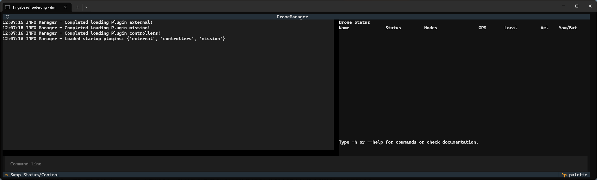

Installation
============

We recommend installing DroneManager in its own virtual environment: https://docs.python.org/3/library/venv.html

1. Clone this repository
2. Move into the root directory of the repository
3. On Windows only: ``python windows_setup.py``
4. Install with pip::

      pip install --upgrade pip
      pip install -e .

.. note::
   The additional script on windows is required to install MSVC and the MAVSDK Server binary, which isn't shipped with
   the installation.

After installation, DroneManager can be started by typing "dm" in a terminal with the venv active. The first start-up
can take a few moments, and then you should have a blank instance of DroneManager to work with!

Simulated Drones
----------------

It is often more convenient to work with simulated drones, rather than real ones. DroneManager should work with any
simulation that also supports MAVLink. We use the PX4 Gazebo SITL, which can be installed on Ubuntu or in Windows WSL
following the `instructions here`_.

.. _instructions here: https://docs.px4.io/main/en/dev_setup/dev_env_linux_ubuntu#simulation-and-nuttx-pixhawk-targets

For a WSL install, we recommend mirrored networking, with the Windows firewall configured to allow traffic from WSL.
Connecting between Gazebo and DroneManager then works as if both were running on the same OS.

PX4 SITL also supports multi drones in one environment, please refer to `their documentation`_ for details.

.. _their documentation: https://docs.px4.io/main/en/sim_gazebo_gz/multi_vehicle_simulation
