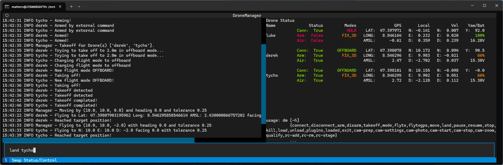

Usage
=====

.. contents:: Table of Contents
   :depth: 2
   :local:
   :backlinks: none

Quick Start
-----------

.. note::
  This guide assumes that you also installed the PX4 SITL environment so we can use simulated drones.

A command ``dm`` is set up as part of the installation. Typing this command into a terminal will start a new
DroneManager instance and terminal interface.

The interface is split into three components:

- A log pane on the left that shows messages, confirmations and warnings.
- A status pane on the right that shows key information for any connected drones, such as the position.
- A command line on the bottom, which is the main way to interact with drone manager.

In one terminal, activate the venv and start up DroneManager by typing ``dm``.
In a separate terminal, start up a PX4 SITL drone by moving to the PX4 SITL root directory and typing
``make px4-sitl gz_x500``.

To connect to the simulated drone with DroneManager, click on the command line at the bottom and type::

   connect tom

This creates a new drone object, assigns it the name ``tom`` and tries to connect to a MAVLink Node with the given
connection string. You can provide any name, it will be used to identify the drone in other commands.

.. note::
   Typing any command with ``- -help`` or ``-h`` prints a help string for that command.

.. note::
   As a convenience feature, we provide a config file in which drone names and their connection string as well as other
   parameters may be saved. When entered with a name from this config file, the connect function will use the parameters
   from the file unless overridden in the command line.

After a short moment, you should see text pop in on the status pane showing information for our newly connected drone.

To arm the drone, type::

   arm tom

You should see the arm state of the drone switch. A few moments later, the drone should automatically disarm.

To take-off, arm the drone again and then type::

   takeoff tom

The drone should take-off to about 2 meters above the ground.

To move the drone to a coordinate (in the local coordinate system) type::

   flyto tom 10 0 -2 -90

This flies the drone to a position 10m north of the takeoff point at about the same altitude, facing west.
Note that the local coordinate system uses the NED convention, i.e. up is negative.

To move the drone by a certain amount::

   move tom -5 0 0 0

which moves the drone 5m toward the south of its current position, keeping everything else the same.

You can also fly the drone to a GPS coordinate::

   flytogps tom <lat> <long> <amsl> <yaw>

Land the drone with::

   land tom

After landing, the drone should auto-disarm. If not, you can type ``disarm tom``.

Flying a drone with these commands by hand can be quite tedious, as you have to eye-ball distances and facings. We
also support game pads. The ``controllers`` plugin is loaded by default. If you connect a DualShock 4 you can use it to
fly the drone with no further text commands.

.. note::
  If you have been using WSL so far, the controller will not work out of the box. You will have to either configure WSL
  to use USB devices, or run DM in Windows with Gazebo on WSL. We use the second method. This requires adjusting the
  firewall to allow traffic from WSL to Windows, and depending on the network configuration of your WSL (NAT or mirrored)
  you might have to provide the connection string with the IP of the WSL instance.

Controls:

+-----------------------+-----------------------+
| Input                 | Action                |
+=======================+=======================+
| PS Button             | Take/release control  |
+-----------------------+-----------------------+
| Circle                | Arm                   |
+-----------------------+-----------------------+
| X                     | Disarm                |
+-----------------------+-----------------------+
| D-pad up              | Take-off              |
+-----------------------+-----------------------+
| D-pad down            | Land                  |
+-----------------------+-----------------------+
| Right stick           | Horizontal movement   |
+-----------------------+-----------------------+
| Left stick vertical   | Vertical movement     |
+-----------------------+-----------------------+
| Left stick horizontal | Yaw                   |
+-----------------------+-----------------------+

.. note::
   We currently only support the DualShock 4, as that is the only controller we have access to. However, we use pygame
   for the game pad support, so many more are supported in principle. You will have to make your own keybinds however.
   See the documentation of the controller plugin for information.

That's it for the core controls. However, for your research you will probably want to test some algorithms or use real
drones in some workflow. DroneManager enables this by making these core commands and more also available
programmatically.

A key feature to enable repeatable work is our "mission" concept. In principle, they are just fancy scripts. They can
do anything you could put into a python script, but can also readily make use of safety features we have developed,
automatically generate commands for the terminal interface, while still allowing manual control as well.
In the next section, we take a look at an example mission with multiple drones.

See :ref:`the mission guide <guide_mission>` for more information on setting up your own.

Script usage
------------

DroneManager can also be used without the terminal interface. For example, the following code will create a DM
instance, connects to a drone and performs some basic maneuvers::

    import asyncio
    from dronemanager.dronemanager import DroneManager
    from dronemanager.drone import DroneMAVSDK

    async def main():
        drone_type = DroneMAVSDK
        dm = DroneManager(drone_type, log_to_console=True)
        await dm.connect_to_drone("tom")
        await asyncio.sleep(1)  # Small grace period to allow parameters to load
        await dm.arm("tom")
        await dm.takeoff("tom", altitude=3)
        await dm.fly_to("tom", local=[10, 0, -3], yaw=0)
        await dm.move("tom", offset=[-10, 0, 0], yaw=0)
        await dm.land("tom")
        while dm.drones["tom"].in_air:  # PX4 sometimes takes a little bit to recognize that we have landed
            await asyncio.sleep(0.5)
        await dm.disarm("tom")
        await dm.close()

    asyncio.run(main())

All the CLI commands are also available as functions. Plugins can be loaded and are accessible as attributes of the DM
instance under the name of the plugin.

Example mission
---------------

This is a showcase demo where three drones look for a POI and start continuously observing it.
To run it, you will need three drones, preferably running PX4, a dummy object of interest and a 7 x 3 x 3 meter area 
where you can fly multiple drones with high precision.
We ran this demo in an indoor environment with an OptiTrack system for positioning. Each drone was configured to
communicate on a separate port, see :ref:`common issues <connection_issues>`. The setup instructions for real drones
below assume a similar setup.

If you don't have an indoor flying set up ready to go, we suggest going outside and using GPS instead. The setup will 
have to be modified to allow for positioning errors from GPS by increasing the flight area significantly, at least triple.
Relevant parameters are in the ``init`` function of the mission and include ``flight_area``, ``search_space``, 
``start_position_x``, ``flight_altitude``, ``poi_position`` and ``holding_position``. You will also have to ensure the
drones share a common local coordinate system. You can do this by powering them on one by one in the center of the
flight area with the same heading and then moving them to their start positions.

The mission can also be run with simulated drones, but you will again have to make sure that they share a coordinate
system.

Setup - Real drones
^^^^^^^^^^^^^^^^^^^

1. Boot up DroneManager.
2. Place the drones at their start positions. Note that these positions are fixed in the script, and the order matters.
   The first drone should be at (3, -1.25), the second at (3, 0) and the third at (3, 1.25).
3. Connect to the three drones using ``connect <name> <connection-string>``. The connection string depends on how your
   drones are configured.
4. Load the mission scripts: ``mission-load uam``
5. Add all the drones to the mission: ``uam-add <name>`` IMPORTANT! The order in which the drones are added matters. The
   first drone has start position (3, -1.25), the second one (3, 0) and the third (3, 1.25). If the drones are added in
   the wrong order, they might collide during flight as their paths can cross. With ``uam-status``, you can see the
   order of the drones. Make sure each drone reports the correct position. If drones were added in the wrong order, you
   can either rearrange them on the field, or remove them with ``uam-remove <name>`` and then add them again.
6. Check that each drone reports the correct position in DroneManager, as noted above.
7. Do ``uam-set`` to change the mission state to "ready-to-go". With ``uam-unset`` you can go back to Uninitialized.

Setup - Gazebo
^^^^^^^^^^^^^^

The setup with simulated drones is a little convoluted, as all three drones need to share a local coordinate system and
thus must be started at the same location.

1. Boot up DroneManager
2. Load the mission scripts: ``mission-load uam``
3. Start a single gazebo drone using
   ``PX4_SYS_AUTOSTART=4001 PX4_SIM_MODEL=gz_x500 PX4_GZ_MODEL_POSE="0,0" ./build/px4_sitl_default/bin/px4 -i 0`` and
   connect to it with DroneManager.
4. Add the drone to the mission with ``uam-add <name>``.
5. Move the drone to its start position with ``uam-reset``.
6. Repeat steps 3 through 5 for two more drones, incrementing the ``-i`` argument each time.
   Do not adjust the ``MODEL_POSE`` argument. Don't disconnect or remove the drones that
   are already set up. For each subsequent drone, all the drones will reshuffle to their new start positions in
   sequence.
7. Check that each drone reports the correct position in DroneManager. The first drone should be at (3, -1.25), the
   second at (3, 0) and the third at (3, 1.25). Also check in Gazebo, that they are neatly lined up. If there is a
   significant offset, the local coordinate systems likely diverged. Make sure each drone is initialized in gazebo at
   the same position!
8. Do ``uam-set`` to change the mission state to "ready-to-go". With ``uam-unset`` you can go back to Uninitialized.

Mission
^^^^^^^

With the drones connected and all the scripts loaded you can begin flying missions.

1. For the single search pattern: Start the mission with ``uam-singlesearch``. The first drone will fly the rectangular 
   search pattern and start circling the object indefinitely once it finds it. To return it, do ``uam-rtb``.
2. For the group search: Start the mission with ``uam-groupsearch``. All drones will launch and fly forwards to the other 
   end. The drone that finds the POI will stay with the POI, the other two come back, land and disarm. The observing 
   drone starts circling until its (faked) battery runs low, when one of the drones will arm, takeoff and fly to do the 
   swap. The observing drone will stop circling and wait until the swapping drone has eyes on the object, at which point 
   the observing drone will rtb on its own. This swapping happens indefinitely. To stop the mission, do ``uam-rtb``.
3. To fly drones from any position to their start position one-by-one you can use ``uam-reset``. This should only be used 
   in Gazebo, the drones should already be at their start positions in a real demo.

Configuration file
------------------

To prevent having to reenter commands constantly, a number of DroneManagers aspects can be adjusted permanently with the
``config.json`` file. It has three main components. The first are parameters for DroneManager itself, such as the
MAVLink system ID, or the plugins that are automatically loaded on startup. Second is a list of plugin settings.
This entry lists each plugin and a series of parameters which are passed to the plugin when it is initialized.
The final component is a list of drones and parameters for them::

    {
      "drone_name": "tom",                    # Drone name, must match connection command
      "address": "udp://192.168.1.31:14561",  # Connection string,
      "position_rate": 5.0,                   # Request position/attitude, etc telemetry at this frequency
      "max_h_vel": 10.0,                      # This parameter and below define speed, acceleration and jerk limits
      "max_down_vel": 1.0,
      "max_up_vel": 3.0,
      "max_h_acc": 1.5,
      "max_v_acc": 0.5,
      "max_h_jerk": 0.5,
      "max_v_jerk": 0.5,
      "max_yaw_vel": 60,
      "max_yaw_acc": 30,
      "max_yaw_jerk": 30,
      "log_telemetry": false,                 # Whether to log every MAVLink message. Somewhat slow.
      "rtsp": "rtsp://192.168.1.31:8900/live",  # RTSP Stream information, currently not used.
      "size": 1.0                             # The size of the drone. Currently not used.
    }

These parameters are used when a matching name is used during connection. Instead of typing
``connect tom udp://IP:port -f 30 -l False`` everytime you want to use this drone, you can adjust the parameters in the
config file and they will be loaded automatically with just ``connect tom``. If you supply an argument in the command
line, it is used instead of the config file. The file is left unchanged by this.
The speed, acceleration and jerk limits are used for autonomous navigation functions by default.
There is one special drone entry, which is called "default". These parameters are used when no matching name is found.

Common Issues
-------------

Fundamentally, our software works by sending commands to the flight controller (or another piece of hardware on the
drone), which then executes those commands. We've set up and tested our software to work with default PX4 and Ardupilot
configurations out-of-the-box, but if the flight controller doesn't respond as our software expects it too,
there isn't much we can do.
For example, depending on configuration of the flight controller, the "home" position might be the take-off position,
or it might be the coordinate origin point, usually set at boot-up for the local coordinate system. Imagine booting up
a drone on a desk, then carrying it to the take-off point, then setting up your laptop and notes on the same desk. When
you tell the drone to return-to-base, it might very well try to land on your laptop.
When working with real drones you should always test the actual behaviour in a safe environment before risking hardware
(or lives!).

.. _connection_issues:

Connection Issues
^^^^^^^^^^^^^^^^^

UDP communication over MAVLink happens in a few different patterns. Drones are configured to communicate on a specific
port, we will call it the MAVPort, usually 14550 or 14540. They should broadcast their heartbeat on that port and be
discoverable without knowing their specific IP.

However, it is in our experience quite rare for these heartbeats to arrive, whether due to firewall issues or the
broadcast rules of some intermediate node. To cover this case, we also send heartbeats to the drone directly from a
separate port. In our experience, it varies widely how drones respond to this. Some answer on the port from which the
heartbeat was sent. Some answer on the MAVPort. Some answer on the heartbeat port, but only for the first connection
they receive. DroneManager should cover all these cases, except in the last case, once a drone has been disconnected
and the ports closed, the drone itself will have to be restarted before a connection can be re-established. Note
that this only applies if the drone is actively disconnected and the ports are closed, a temporary connection loss
maintains the ports.

In principle, multiple drones can connect on the same port if their system IDs are different. In practice however, a
lot of MAVLink software and SDKs do not actually support this, and information from and commands to the different
drones gets mangled. If you want to use multiple drones at once, we highly recommend setting each drone to communicate
on a different port.

Coordinate Systems
^^^^^^^^^^^^^^^^^^

With PX4 and Ardupilot there are two main coordinate systems:

- Global: Latitude, longitude and altitude above mean sea level.
- Local: A ``(x,y,z)`` cartesian coordinate system assuming a flat earth but with arbitrary axes and origin, usually
  initialized at boot-up.

Both come with their own downsides and idiosyncrasies. Note that the coordinate system used is independent of how the
drone determines its position. For example, a drone might use GNSS positioning but can still keep a local coordinate
system.

The global coordinate system requires a GNSS signal, making it generally inaccessible indoors, and often has poor
accuracy, which can make coordinating multiple drones difficult and be a challenge for reproducibility as well.

The local coordinate system can change significantly depending on the configuration of the firmware.
The standard configurations have the axes aligned with north, east and down and the origin set wherever the flight
controller first got some kind absolute position fix, usually shortly after boot-up. So if you have multiple drones
and you are setting them up in different locations, they will have different local coordinate systems.
With an external visual tracking system for positioning, the tracking system might use a forward, right and up
convention, while the drone expects forward, right and down.
With visual odometry instead of an absolute system, the axes might be aligned with the orientation of the drone at
boot-up.

